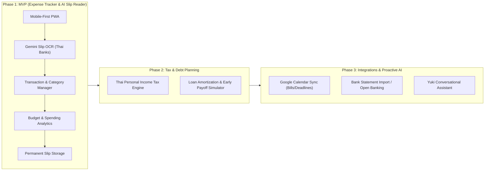

# Product Requirement Document (PRD): Yuki – Personal Finance Assistant

**Project Name:** Yuki (`jj-personal-yuki`)  
**Product Type:** AI-Powered Personal Finance Web Application (Mobile-First / PWA)  
**Primary User:** Personal / Single-User (Extensible to Multi-User)  
**Core Vision:** An intelligent, holistic financial co-pilot that manages every dimension of personal money—starting from zero-friction daily expense tracking to proactive Thai tax optimization and loan debt elimination.

---

## 1. Executive Summary & Vision

Traditional personal finance apps fail because of **manual logging friction** and **fragmented tools** (one app for budgeting, another Excel sheet for tax planning, and another calculator for mortgage prepayment). 

**Yuki** solves this by acting as a unified financial assistant:
1. **Eliminate logging friction:** Snap or upload a Thai bank transfer slip or receipt, and Yuki uses Gemini Multimodal Vision to auto-extract transaction details, categorize it, and record it in seconds.
2. **Permanent Audit Trail:** Slips and receipts are kept indefinitely in encrypted storage linked to transaction records for complete auditability.
3. **Optimize wealth & liabilities (Phase 2):** Plan Thai personal income tax deductions (SSF, RMF, Thai ESG, allowances) and simulate loan payoff strategies (extra principal payments, interest savings).
4. **Automate & Remind (Phase 3):** Sync bill due dates and loan payments with Google Calendar, and import bank statements seamlessly.

---

## 2. Product Roadmap & Phasing



---

## 3. Technology Stack & Architecture

| Layer | Technology | Rationale |
| :--- | :--- | :--- |
| **Frontend Framework** | Next.js 15 (App Router, React 19) | High performance, server rendering, modern React ecosystem. |
| **Styling & Components** | Tailwind CSS + Shadcn UI + Lucide Icons | Clean, highly customizable, mobile-first design language. |
| **Mobile Form Factor** | Progressive Web App (PWA) | Installable on iOS/Android home screen, app-like navigation, offline shell caching. |
| **Backend & API** | Next.js Server Actions / API Routes | Unified TypeScript codebase, secure backend execution. |
| **Database** | Supabase (PostgreSQL) | Relational integrity, instant SQL aggregations (`SUM`, `GROUP BY`), foreign keys, and Row-Level Security (RLS). |
| **Authentication** | Supabase Auth | Email/Password or Google OAuth with secure session management. |
| **File Storage** | Supabase Storage | Encrypted, private S3-compatible bucket for permanent slip image retention. |
| **AI Vision Engine** | Google Gemini 2.5 Flash (`@google/genai`) | High-speed multimodal OCR, native JSON structured schema output, exceptional Thai text/bank slip understanding. |
| **Data Visualization** | Recharts | Smooth, touch-friendly charts for mobile and desktop views. |

---

## 4. Data Model Specification (PostgreSQL Schema)

```sql
-- 1. Financial Accounts (KBank, SCB, Cash, Credit Card, etc.)
CREATE TABLE accounts (
    id UUID PRIMARY KEY DEFAULT gen_random_uuid(),
    user_id UUID REFERENCES auth.users(id) ON DELETE CASCADE,
    name VARCHAR(100) NOT NULL,
    type VARCHAR(50) NOT NULL, -- 'savings', 'credit_card', 'cash', 'e_wallet'
    bank_code VARCHAR(20),      -- 'KBANK', 'SCB', 'KTB', 'BBL', etc.
    account_number_mask VARCHAR(10), -- e.g. 'xxx-x-x1234'
    current_balance NUMERIC(12, 2) DEFAULT 0.00,
    currency VARCHAR(10) DEFAULT 'THB',
    color_hex VARCHAR(7) DEFAULT '#3B82F6',
    created_at TIMESTAMPTZ DEFAULT now()
);

-- 2. Expense & Income Categories
CREATE TABLE categories (
    id UUID PRIMARY KEY DEFAULT gen_random_uuid(),
    user_id UUID REFERENCES auth.users(id) ON DELETE CASCADE,
    name VARCHAR(100) NOT NULL,
    type VARCHAR(20) NOT NULL, -- 'expense', 'income'
    icon VARCHAR(50) DEFAULT 'wallet',
    color_hex VARCHAR(7) DEFAULT '#10B981',
    is_tax_deductible BOOLEAN DEFAULT FALSE,
    tax_category VARCHAR(50)   -- 'easy_receipt', 'donation', 'medical'
);

-- 3. Transactions
CREATE TABLE transactions (
    id UUID PRIMARY KEY DEFAULT gen_random_uuid(),
    user_id UUID REFERENCES auth.users(id) ON DELETE CASCADE,
    account_id UUID REFERENCES accounts(id) ON DELETE SET NULL,
    category_id UUID REFERENCES categories(id) ON DELETE SET NULL,
    type VARCHAR(20) NOT NULL, -- 'expense', 'income', 'transfer'
    amount NUMERIC(12, 2) NOT NULL,
    currency VARCHAR(10) DEFAULT 'THB',
    transacted_at TIMESTAMPTZ NOT NULL,
    merchant_or_payee VARCHAR(255),
    description TEXT,
    
    -- Slip & OCR Details
    slip_image_url TEXT,                 -- Permanent storage path in Supabase bucket
    slip_ref_no VARCHAR(100) UNIQUE,     -- Bank transaction reference ID (prevents duplicates)
    ocr_confidence NUMERIC(4, 3),
    raw_ocr_payload JSONB,               -- Raw Gemini structured JSON
    
    -- Tax flags
    is_tax_deductible BOOLEAN DEFAULT FALSE,
    tax_record_id UUID,
    
    created_at TIMESTAMPTZ DEFAULT now(),
    updated_at TIMESTAMPTZ DEFAULT now()
);

-- 4. Monthly Budgets
CREATE TABLE budgets (
    id UUID PRIMARY KEY DEFAULT gen_random_uuid(),
    user_id UUID REFERENCES auth.users(id) ON DELETE CASCADE,
    category_id UUID REFERENCES categories(id) ON DELETE CASCADE,
    month_year VARCHAR(7) NOT NULL, -- '2026-09'
    budget_limit NUMERIC(12, 2) NOT NULL,
    created_at TIMESTAMPTZ DEFAULT now()
);

-- 5. Loans (Phase 2)
CREATE TABLE loans (
    id UUID PRIMARY KEY DEFAULT gen_random_uuid(),
    user_id UUID REFERENCES auth.users(id) ON DELETE CASCADE,
    name VARCHAR(100) NOT NULL, -- 'Condo Mortgage', 'Car Loan'
    principal_amount NUMERIC(12, 2) NOT NULL,
    remaining_balance NUMERIC(12, 2) NOT NULL,
    interest_rate_annual NUMERIC(5, 3) NOT NULL, -- e.g. 4.75%
    monthly_payment_min NUMERIC(12, 2) NOT NULL,
    start_date DATE NOT NULL,
    term_months INT NOT NULL,
    created_at TIMESTAMPTZ DEFAULT now()
);
```

---

## 5. Phase 1 (MVP) – Detailed Feature Requirements

### 5.1 AI Slip & Receipt Ingestion Pipeline
- **Input Formats:** JPEG, PNG, WEBP, HEIC (camera capture or file picker).
- **Client-side Preprocessing:** Compress image to WebP (max 1600px dimension) before network transmission to save bandwidth.
- **Multimodal AI Model:** Google Gemini 2.5 Flash via `@google/genai`.
- **Extraction Schema (JSON):**
  ```json
  {
    "bank_name": "Kasikornbank | SCB | Krungthai | Bangkok Bank | Other",
    "amount": 350.00,
    "currency": "THB",
    "transaction_date": "YYYY-MM-DDTHH:mm:ss+07:00",
    "sender_name": "string or null",
    "receiver_name": "string or null",
    "reference_no": "unique transaction identifier from slip",
    "detected_category": "Food & Dining | Transport | Shopping | Bills | etc.",
    "confidence": 0.98
  }
  ```
- **Duplicate Prevention:**
  - Before saving, query `transactions.slip_ref_no`.
  - If a match is found, prompt: *"This slip was already logged on [Date] for ฿[Amount]"*.
- **Slip Storage:**
  - Image is uploaded to private Supabase Storage bucket: `slips/{user_id}/{year}/{ref_no}.webp`.
  - Retained **indefinitely**.
  - Accessible via authenticated signed URLs.

### 5.2 Transaction Management & Manual Entry
- Floating Action Button (FAB) on mobile for:
  - 📸 Scan Slip / Receipt (Camera / Upload)
  - ✍️ Quick Manual Entry (Amount keypad, category picker, account selector)
- Transaction List View:
  - Search by payee, merchant, note, or amount.
  - Filter by date range, account, and category.
  - Swipe to delete or tap to edit.
  - Slip thumbnail with 1-tap full-screen preview.

### 5.3 Dashboard & Spending Insights
- **Monthly Summary Cards:** Total spent, total income, net cash flow.
- **Daily Burn Rate:** Current daily average vs. recommended daily pace to stay under budget.
- **Category Breakdown:** Donut chart showing top spending categories.
- **Recent Activity:** Stream of latest 5 transactions with slip status indicator.

### 5.4 Mobile PWA Experience
- Standalone display mode (no browser URL bar when launched from home screen).
- Bottom navigation bar:
  - `Dashboard` | `Transactions` | `(+) Add` | `Analytics` | `Settings`
- Fast, responsive layout with iOS safe-area notch padding.

---

## 6. Phase 2 – Thai Tax Planning & Loan Amortization

### 6.1 Thai Personal Income Tax (PIT) Engine
- Calculates progressive personal income tax brackets (0% to 35%).
- Tracks tax deductions:
  - Personal allowance (฿60,000) & employment expense deduction (50% up to ฿100,000).
  - Social Security Fund (SSF, up to ฿9,000).
  - Provident Fund (PVD) / กบข.
  - Life & Health Insurance (up to ฿100,000).
  - Mortgage Interest (up to ฿100,000).
  - Investment Funds: SSF, RMF, Thai ESG (with allowance caps).
  - Easy E-Receipt / Tax-deductible shopping receipts.
- **Tax Gap Optimizer:** Calculates exact investment needed in Thai ESG / RMF to drop into a lower tax bracket.

### 6.2 Loan Repayment Planner
- Reducing Balance (ลดต้นลดดอก) calculation for home mortgages and auto loans.
- Amortization schedule showing monthly principal vs. interest breakdown.
- **Early Payoff Simulator:** Interactive slider for extra monthly principal payments (+฿1,000, +฿5,000, +฿10,000) showing:
  - Total interest saved over the loan lifespan.
  - Time shaved off repayment (years/months).

---

## 7. Phase 3 – Integrations & Conversational AI

- **Google Calendar Integration:** Sync recurring bill dates, credit card due dates, and tax filing deadlines.
- **Bank Statement Import:** Parse official monthly PDF/CSV statements from Thai banks.
- **Yuki AI Chat:** Conversational queries on personal finances (*"How much have I spent on food this month?"*, *"Can I afford this ฿20,000 purchase?"*).

---

## 8. Security & Data Privacy

- **Row-Level Security (RLS):** Every database row is strictly locked to the authenticated `user_id`.
- **Private Image Bucket:** Slips are not publicly accessible; accessed only through signed URLs generated for the owner.
- **Zero Third-Party Trackers:** No external ad tracking or telemetry scripts.
